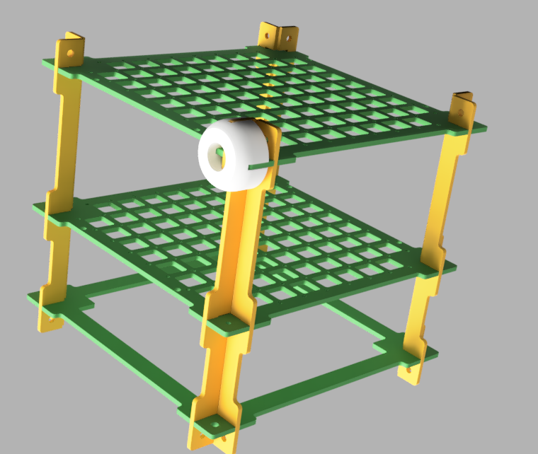

# Verificación de IMUs

En este repositorio se encuentran los archivos de diseño para un dispositivo destinado a la verificación de IMUs. El diseño se basa en el [Cubo de Calibración](https://github.com/xioTechnologies/Calibration-Cube) propuesto por Madgwick, pero en este caso no se utiliza para calibración, sino para verificar los valores de orientación espacial generados por una IMU a partir de la fusión de datos de sensores inerciales y/o magnetómetros.

El dispositivo tiene dos variantes, una de ellas utilizada para verificaciones estáticas, donde la plataforma se mueve de manera manual siguiendo posiciones preestablecidas cada 5º.

Y otra variante donde se monta sobre un servo (MG996R) para verificaciones dinámicas, asistidas por análisis de video.

## Implementación

El diseño esta pensado para ser impreso en 3D, para la versión estática es necesario imprimir:

| Parte             | Cantidad |
| :---------------- | -------: |
| base              | 1        |
| base_completa     | 2        |
| pata              | 2        |
| tirante           | 8        |
| protractor        | 1        |
| rotor             | 1        |
| pata              | 2        |
| tuerca            | 1        |
| soporte_elastico  | 1        |
| tornillo          | 1        |

El **tornillo** mantiene el **rotor** contra el **protractor** mediante la **tuerca**, la cual cuenta con un par de canales por los cuales pasar una banda elástica que va sujeta finalmente al **soporte_elastico**. La tensión ejercida por la banda es la suficiente para mantener el **rotor** en su lugar, pero permite que facilmente pueda ser retirado para modificar la posición angular.

El cubo se ensambla como se muestra en la imágen superior. Las piezas se sostienen por la misma fricción de las piezas plásticas.

La fijación del cubo al rotor se realiza con tornillos plásticos M2. La utilización de plástico para toda la construcción intenta minimizar la presencia de materiales ferromagnéticos que puedan afectar las mediciones del magnetómetro.

Para la versión dinámica es necesario imprimir:

| Parte             | Cantidad |
| :---------------- | -------: |
| rotor_servo       | 1        |
| soporte_servo     | 1        |
| marker            | 3        |

En este caso el cubo de calibración se monta en el **rotor_servo** y este a su vez a un servo. Los marcadores se pueden colocar en las esquinas del cubo para facilitar el trackeo de los movimientos mediante el uso de Software.

Tanto las **patas** de la versión estática como el **soporte_servo** de la dinámica pueden ser sujetas mediante [clamps](https://www.thingiverse.com/thing:1673030).

Se adjunta además un soporte impreso (**bno08x_holder**) para una módulo [BNO085 de Adafruit](https://www.adafruit.com/product/4754) y un par tornillo-tuerca (**m5-nut-105**/**m5-screw-95**) para la sujeción del soporte al cubo de calibración. El montaje de la placa al soporte se realiza también con tornillos M2 plásticos.

## Electrónica

Se adjunta además los [fuentes](./Firmware) utilizados para levantar los datos. Por un lado el firmware de una placa ESP32-S2 de Adafruit conectada al BNO085 para el envío de datos a la PC. Por otro lado el firmware de un Arduino Uno, el cual controla los movimientos del servo y habilita la transmisión de datos del BNO a la PC. El ESP32 enciende un led al inicio del envío de datos y todo el proceso comienza al presionar un pulsador conectado al Aruino Uno. Todo esto tiene como propósito simplificar el procesos de captura de datos, mantener consistencia entre los ensayos y facilitar la sincronización de los datos recabados.

A continuación se muestraa a modo de ejemplo una captura del análisis de datos para rotaciones alrededor del eje y. Los datos de del tracker se obtuvieron a partir de análisis de video utilizando el software [Tracker](https://physlets.org/tracker/). 

Setup utilizado, para yaw (a la izq.), y pitch y roll a la derecha. Para el video se utilizó una Webcam PlayStation Eye capaz de tomar video hasta 187 FPS.

## Autores

* Juan Ignacio Cerrudo (juan.cerrudo@uner.edu.ar)